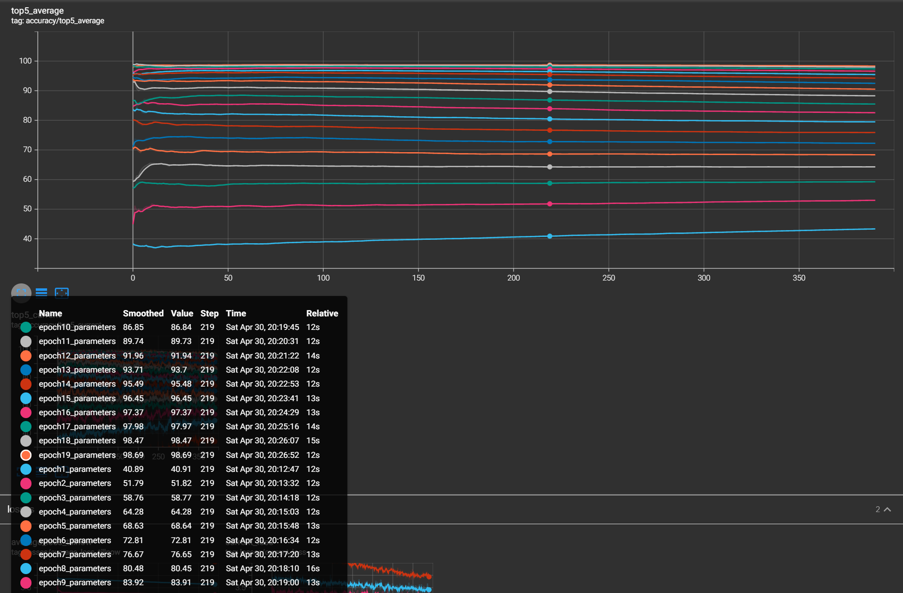
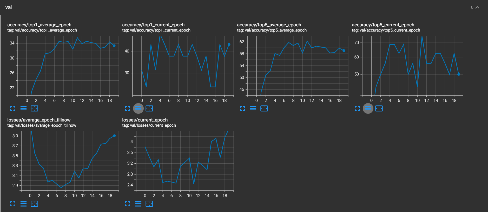

<font size = 7><center>**实验报告**</center></font>
<p align = 'right'>夏远林-PB19020632</p>

[toc]

# Task1 网络层级

可以从网络结构这张图片中看出，整个网络共计**4层**  

* 第一层:Sequential[layer1],包含2个BasicBlock，输出为2个64x64x2x2的tensor  

* 第二层:Sequential[layer2],包含2个BasicBlock，输出为2个64x128x1x1的tensor  

* 第三层:Sequential[layer3],包含2个BasicBlock，输出为2个64x256x1x1的tensor  

* 第四层:Sequential[layer4],包含2个BasicBlock，输出为64x512x1x1的tensor

* 最后经过Linear(fc)的处理，输出为64x200的一个output

# Task2 改动说明

改动说明，详见```latest.patch```文件

# Task3&4 曲线分析

我训练了2个epoch，从**epoch0~epoch20**  
下面是具体的图片  

## 每个epoch中的top1正确率的average的变化


<font size = 4>那么从上面这张图片我们可以看到，随着epoch提升，正确率提升，但是在单个epoch中，前几个epoch的正确率随着**训练进度增加**而**增加**，但是在最后几个epoch当中，平均正确率随着**训练进度增加**而**降低**</font>

## 每个epoch中的top5正确率的average的变化



<font size = 4>同样与top1相同，趋势是类似的，不再赘述</font>

## 每个epoch结束时训练集精度，Loss的变化曲线


<font size = 4>从上面的曲线我们可以看到，top1和top5的精度都是随着epoch增加而增加的，loss是单调递减的，并且这些曲线的斜率都在逐渐减少，二阶导是负数(正数)，这就说明训练效果在逐渐减少，**逐渐收敛**到最后的效果</font>   

## 每个epoch结束时验证集精度，Loss的变化曲线



<font size = 4>从验证集的变化曲线可以看到，Loss在第7个epoch结束后达到最小，随后反而出现增加，并且top1、top5正确率**average**在第7个epoch之后出现停滞，也就是说明训练效果并没有增加。同时对比训练集的曲线，我们可以发现，训练集的精度在不断提升，可是验证集几乎没有提升，所以可以认为是欠拟合，并不能正确预测验证集，**训练效果欠佳**</font>

# Task5 模型比对

<font color = 'green'>我截取了训练完第7个，第15个epoch后(也就是训练了8、16次后的模型)的checkpoint作为评判点</font>

## --evaluate的差异  

```python
epoch7结束后的模型，也就是跑了8个epoch
Test: [ 0/40]   Time 11.463 (11.463)    Loss 2.9716e+00 (2.9716e+00)    Acc@1  31.25 ( 31.25)   Acc@5  57.42 ( 57.42)
Test: [10/40]   Time  0.031 ( 1.064)    Loss 2.7085e+00 (2.8260e+00)    Acc@1  37.11 ( 36.12)   Acc@5  63.67 ( 61.54)
Test: [20/40]   Time  0.016 ( 0.578)    Loss 2.7527e+00 (2.8271e+00)    Acc@1  35.94 ( 35.34)   Acc@5  62.89 ( 61.96)
Test: [30/40]   Time  0.016 ( 0.408)    Loss 2.6896e+00 (2.8594e+00)    Acc@1  35.55 ( 34.64)   Acc@5  61.33 ( 61.61)
 *   Acc@1 34.530 Acc@5 61.780

epoch15结束后的模型，也就是跑了16个epoch
Test: [ 0/40]   Time 11.198 (11.198)    Loss 3.7178e+00 (3.7178e+00)    Acc@1  32.81 ( 32.81)   Acc@5  59.38 ( 59.38)
Test: [10/40]   Time  0.018 ( 1.038)    Loss 3.4118e+00 (3.5012e+00)    Acc@1  35.16 ( 34.80)   Acc@5  60.16 ( 60.58)
Test: [20/40]   Time  0.016 ( 0.564)    Loss 3.5135e+00 (3.5483e+00)    Acc@1  33.20 ( 34.34)   Acc@5  60.55 ( 60.12)
Test: [30/40]   Time  0.031 ( 0.400)    Loss 3.5324e+00 (3.5707e+00)    Acc@1  33.98 ( 33.90)   Acc@5  60.16 ( 59.95)
 *   Acc@1 34.000 Acc@5 60.030
```

那么从上面的输出结果可以看到，程序评判的结果是没有显著的正确率差异，也符合上面的验证集曲线，说明在验证集上，训练效果并没有显著提升  

## 判断不同的照片以及区别  

首先是epoch16的判断以及对应的图片和真实的标签:  

```python
tensor([ True, False, False, False, False], device='cuda:0') # val_0.JPEG 107
tensor([False, False, False, False, False], device='cuda:0') # val_1.JPEG 139
tensor([False, False,  True, False, False], device='cuda:0') # val_10.JPEG 158

tensor([False, False, False, False, False], device='cuda:0') # val_100.JPEG 90
tensor([False, False, False, False, False], device='cuda:0') # val_1000.JPEG 138
tensor([False,  True, False, False, False], device='cuda:0') # val_1001.JPEG 67

tensor([False, False, False, False, False], device='cuda:0') # val_1002.JPEG 135
tensor([False, False, False,  True, False], device='cuda:0') # val_1002.JPEG 198
tensor([ True, False, False, False, False], device='cuda:0') # val_1004.JPEG 38

tensor([False, False, False, False, False], device='cuda:0') # val_1005.JPEG 88
tensor([False, False, False, False,  True], device='cuda:0') # val_1006.JPEG 63
tensor([False,  True, False, False, False], device='cuda:0') # val_1007.JPEG 107

tensor([False, False, False, False, False], device='cuda:0') # val_1008.JPEG 107
tensor([ True, False, False, False, False], device='cuda:0') # val_1009.JPEG 11
tensor([ True, False, False, False, False], device='cuda:0') # val_101.JPEG 42

tensor([False, False, False, False, False], device='cuda:0') # val_1010.JPEG 51
tensor([ True, False, False, False, False], device='cuda:0') # val_1011.JPEG 23
tensor([False, False, False, False, False], device='cuda:0') # val_1012.JPEG 167

tensor([ True, False, False, False, False], device='cuda:0') # val_1013.JPEG 78
tensor([False, False, False, False, False], device='cuda:0') # val_1014.JPEG 195
tensor([False,  True, False, False, False], device='cuda:0') # val_1015.JPEG 134

tensor([False, False, False,  True, False], device='cuda:0') # val_1016.JPEG 162
tensor([False, False, False,  True, False], device='cuda:0') # val_1017.JPEG 27
tensor([ True, False, False, False, False], device='cuda:0') # val_1018.JPEG 170
```

随后是epoch8的判断以及差异:  

```python  
'val_1016.JPEG', 'val_1017.JPEG', 'val_1018.JPEG'
tensor([ True, False, False, False, False], device='cuda:0') 
tensor([False, False, False, False, False], device='cuda:0')
tensor([False,  True, False, False, False], device='cuda:0') # epoch16是认为第3个像，可是epoch8认为第二个像

tensor([False, False, False, False, False], device='cuda:0')
tensor([False, False, False, False, False], device='cuda:0')
tensor([False, False,  True, False, False], device='cuda:0') # epoch16是认为第二个像，可是epoch8认为第三个像   

tensor([False, False, False, False, False], device='cuda:0')
tensor([False, False,  True, False, False], device='cuda:0') # epoch16认为第四像，epoch8认为第三像  
tensor([False, False,  True, False, False], device='cuda:0') # epoch16认为第一像，epoch8认为第三像  

tensor([False, False, False, False, False], device='cuda:0')
tensor([False, False, False, False, False], device='cuda:0') # epoch16认为第五像，可是epoch8认为全都不像，前五个像的里面没有一个真实值
tensor([ True, False, False, False, False], device='cuda:0') # epoch16认为2像，可是epoch8认为1像 

tensor([False, False, False, False, False], device='cuda:0')
tensor([ True, False, False, False, False], device='cuda:0')
tensor([ True, False, False, False, False], device='cuda:0')

tensor([False, False, False, False, False], device='cuda:0')
tensor([ True, False, False, False, False], device='cuda:0')
tensor([ True, False, False, False, False], device='cuda:0') # epoch16认为全都不像，但是epoch8认为第一像真实值  

tensor([ True, False, False, False, False], device='cuda:0')
tensor([False, False, False, False, False], device='cuda:0')
tensor([False, False, False, False, False], device='cuda:0') # epoch16认为第二像真实值，但是epoch8认为前五个像里面没有一个真实值  

tensor([False, False, False, False, False], device='cuda:0') # epoch16认为第四像真实值，但是epoch8认为前五个像里面没有一个真实值   
tensor([False, False, False, False,  True], device='cuda:0') # epoch16认为第四像真实值，但是epoch8认为第五像真实值   
tensor([ True, False, False, False, False], device='cuda:0')
```  

<font color = 'red'>上面的tensor意义为，top5的预测中，第i个位置预测的值是否和真实值相同(bool值)</font>